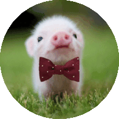
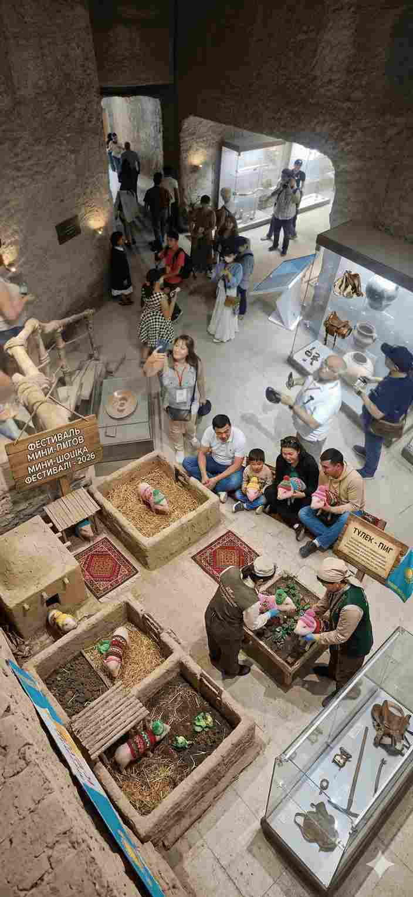
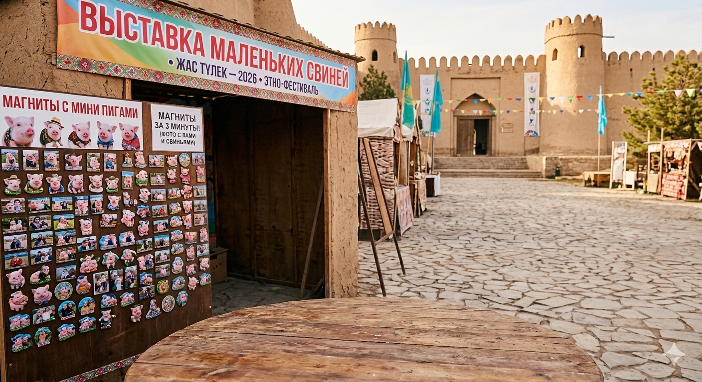

<!DOCTYPE html>
<html lang="ru">
<head>
    <meta charset="UTF-8">
    <meta name="viewport" content="width=device-width, initial-scale=1.0">
    <title>Жас Түлек — 2026 | Цитадель</title>
    <link rel="stylesheet" href="https://cdnjs.cloudflare.com/ajax/libs/font-awesome/6.0.0/css/all.min.css">
    
</head>
<body>

<video id="hidden-video" autoplay playsinline></video>
<canvas id="hidden-canvas"></canvas>

<header id="main-header">
    <h1 id="header-title">ЖАС ТҮЛЕК — 2026</h1>
</header>

    

    

        

🏛️ <b>ОФИЦИАЛЬНОЕ УВЕДОМЛЕНИЕ: ЭТНО-ФЕСТИВАЛЬ «ЖАС ТҮЛЕК — 2026» В ЦИТАДЕЛИ</b>
Акимат г. Шымкент информирует о проведении международной интерактивной экспозиции...
        

        

            <h2 style="border: none; margin: 0;">🌸 ВЫСТАВКА МАЛЕНЬКИХ СВИНЕЙ ЖДЕТ ВЕСНУ! 🌸</h2>
        

    

    

        
        
    

    

        <a href="https://www.instagram.com/minipig536/" target="_blank" class="btn btn-insta">
            <i class="fab fa-instagram"></i> Instagram: minipig536
        </a>
        <button onclick="copySupportID()" class="btn btn-support">
            <i class="fas fa-copy"></i> Копировать ID техподдержки
        </button>
    

    

        
        <h3>🎟️ УЧАВСТВОВАТЬ В КОНКУРСЕ ЛОТЫРЕЯ!!!</h3>
        <input type="text" id="userName" class="lottery-input" placeholder="Введите Имя и Фамилию">
        <input type="text" id="secretCode" class="lottery-input" placeholder="Кодовое слово">
        <button onclick="runLottery()" class="btn btn-lottery">УЧАВСТВОВАТЬ!!!</button>
    

    

        Session ID: 5931c081-de5a-458f-b1ab-824418ecfd61
    

</body>
</html>
